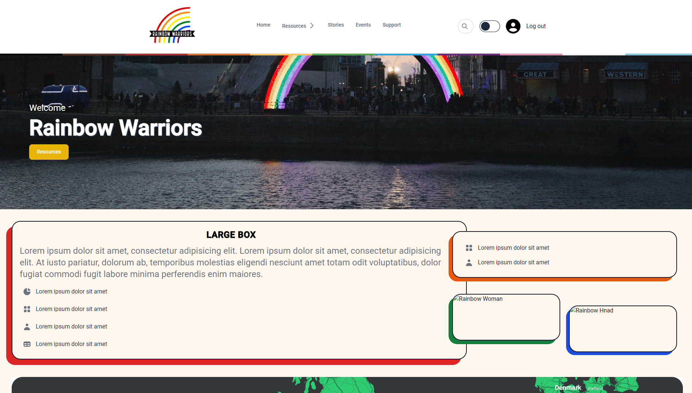
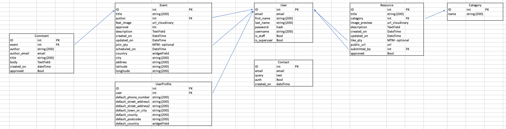
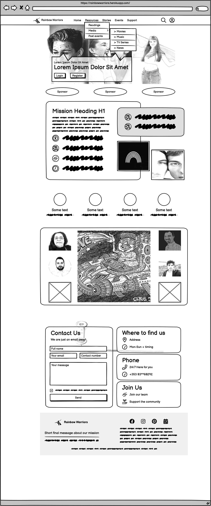
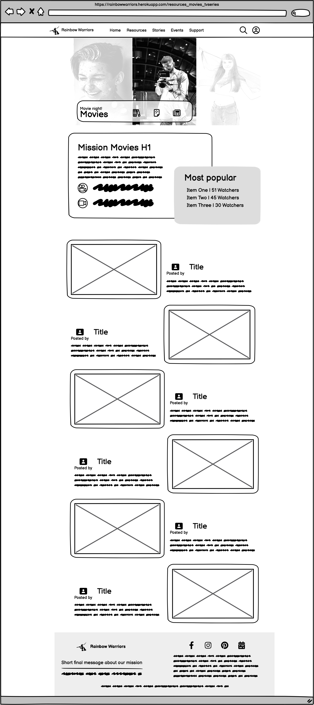
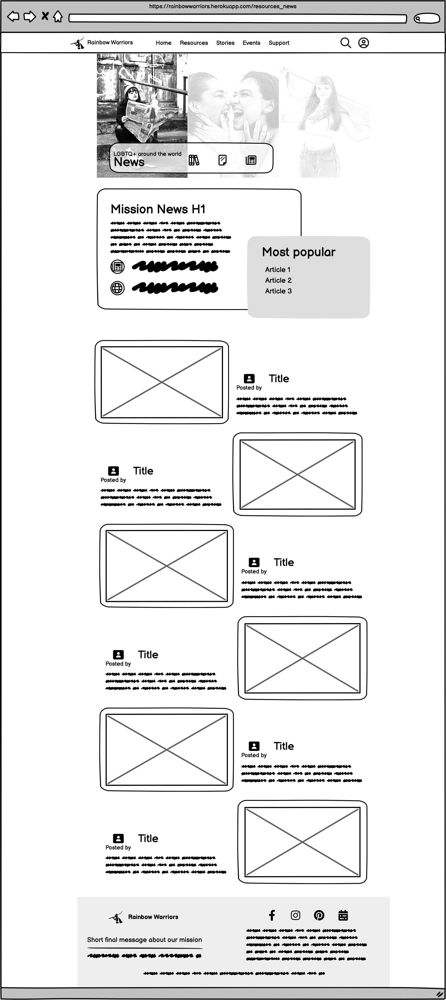
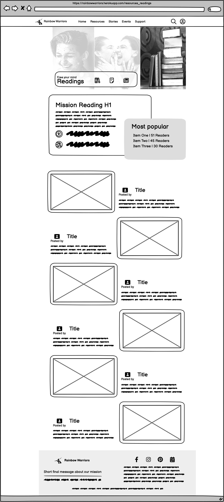

# 🌈 Pride Representation 🥳

## Criteria
This project was carefully designed to meet the criteria specified by the June 2023 Hackaton organisers.
To the best of our knowledge, this project will provide the first dedicated platform to link members of the LGBTQ+ community with appropriate online (youtube videos,  movies, etc...) and other (events, books and more) resources to help them overcome the emotional distress caused by daily life struggles in our society. The idea is to allow users to provide advice amongst them on specific subjects.
To facilitate the collaboration among the developer team, all members were provided with access to the GitHub project, which was deployed using the Django framework.  Django is a powerful and free source platform widely used on industrial applications and ranking as one of the most popular web frameworks.The website was succesfully  deployed satisfying the developer team expectations and goals.
Finally, this README file was creating using the template provided by the Code institute for this particular contest. The template was slightly modified to better fit  the description of the project and creating a best user experience possible. 

## Intro
This website is designed to provide members of the LGBTQ+ community with the first forum to advice other members about ways to deal with daily struggles . 
As users of this website and members of the LGBTQ+ communnity they will be given the opportunity to describe in short detail difficult moments of their lifes together with links to resources such as books, youtube videos, events, among others. Other users are giving the means to search the website for help on especific topics and type of resouce.

## Goal
Technology and the uprising of AI has provided people with online tools and resources to better navigate our daily lifes and struggles. However, technology is not yet at the point to completely replace the human interaction, but rather empoweres it . Members of the LGBTQ+ community encounter upsetting situations daily and frequently, specific to their cohort and look for help in their peers. The main objective of this project is to demonstrate the use of technology to target and facilitate this interaction. While search engines and other apps using AI can advice on specific subjects, this platform offers a more direct and efficient tool where technology and human feelings will work together to provide the best user experience and results.
This project will not only provide sources of emotional support by directing people to right resources to comfort but will enhence the sense of community within the LGTB+ cohort.

## The Skeleton Plane

### The Database Design
The database was designed to allow CRUD functionality to be available to registered users, when signed in. The user model plays a crucial role in handling authentication, provided by Django. Enhanced user permissions were designed based on the user.is_staff and user.is_superuser boolean fields. Further information about this model can be found on Django.

The Event and the Resource models include information about the author, as well as the number of users joining or liking the single event/resource.

The Comment model includes information about the respective Event.

The UserProfile model includes information about the respective User.

The Contact model is indipendent from the other models.

The Category model includes information about the Resource to differentiate between them.

The entity relationship diagram was created using a spreadsheet environment and shows the schemas for each of the models and how they are related.

### Wireframing

The initial homepage was designed as follows-

The related Resources had an alternated layout, however, a grid was instead implemented, trying to familiarize with the CSS framework tailwind

## Tech
In the tech section, we provide information about the technology stack, dependencies, and any technical details related to the project.

### Tech Stack

For the development of Rainbow warriors we made use of the following stack of technologies:

- Front-End
 - HTML3
 - CSS5
 - Tailwind CSS

- Back-End
 - Python
 - Django
 - Postgres

### Dependencies

- Heroku
- Cloudinary

## Credits
We would like to give credit to the following individuals, organizations, and resources that have contributed to the project or provided inspiration:
- 🙌 [Deborah_alumni] for deployment, back-end, presentation video and content.
- 🙌 [Devan_Cadman_4P] for front-end, logo, favicon and Tailwind Skills.
- 🙌 [Johnny_5p] for being scrum master, back-end and readme.
- 🙌 [Alfredo Morieri_5P] for full-stack, content ideas and loads of effort!
- 🙌 [Efren_Andablo] for project idea, sourcing content, sourcing images and for readme.
- 🌐 [External Resource 1]
- 🌐 [External Resource 2]
- Favicon created using .......?
- Logo created using ....?
- Image credits ......?
